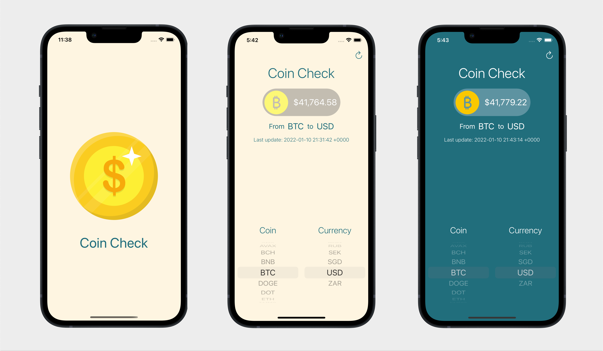

# Coin Check

[](https://www.apple.com/ios/ios-15/)
[](https://developer.apple.com/swift/)
[](https://developer.apple.com/swift/)
[](LICENCE)

<p>  </p>

Cryptocurrency price checker. The app fetch from [CoinAPI.io](https://www.coinapi.io/) the latest coin prices, build with UIKit and MVC + Delegate pattern.

## Features

- Select coin and currency from list.
- Last time price was updated.
- Splash screen.
- Light/Dark mode.
- Localization (English/Spanish).

## Development

- [UIKit](https://developer.apple.com/documentation/uikit)
- MVC + Delegate
- [CocoaPods](https://cocoapods.org)
- Development Target **15.0**
- Swift **5.5**
- Xcode **13.2**

### Dependencies

- [SwiftLint](https://cocoapods.org/pods/SwiftLint)
- [Alamofire](https://cocoapods.org/pods/Alamofire)

### Build

1. Go to [CoinAPI.io](https://www.coinapi.io/) an get a free API key.

2. In `.../CoinCheck/Helpers/Constants.swift` change `key` value with your key.
```swift
struct API {
    static let baseURL: String = "https://rest.coinapi.io/v1/exchangerate"
    static let key: String = "YOUR_API_KEY_HERE"
}
```

3. Run the project!

# License

```xml
MIT License

Copyright (c) 2022 Anibal Ventura
```
